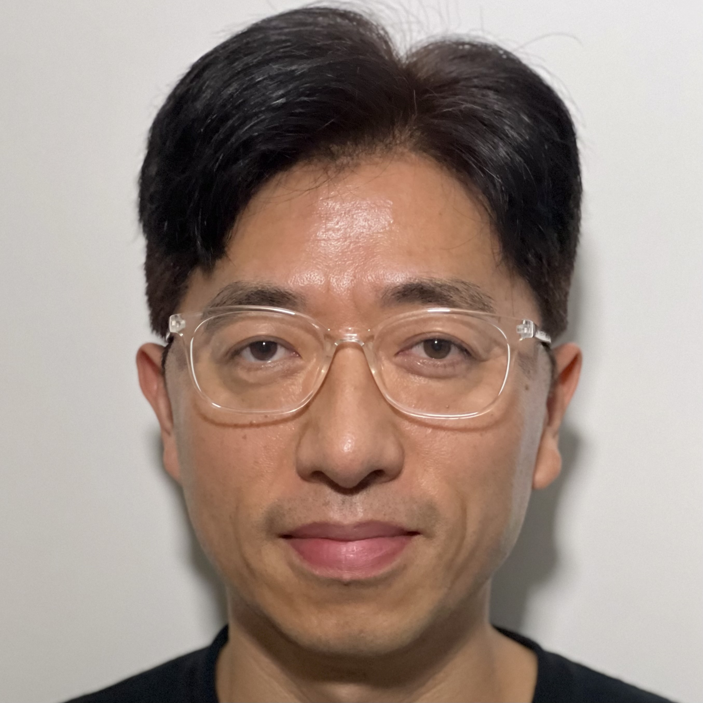

# Mission Statement
Make the large scale machine learning task easier and understandable. So more users can use it readily, create innovative technologies, and eventually make the world a better place. 

<table>
  <tr>
    <td width="200">
      
    </td>
    <td style="vertical-align: middle;">
      <h2 style="border-bottom: none; margin: 0;">T Kim, Ph.D.</h2>
      
Machine Learning Solution Lead, Google Cloud

    </td>
  </tr>
</table>

# Bio
T Kim is a Machine Learning Solution Lead at Google Cloud where he helps users leverage the power of  AI Hypercomputer, Vertex AI, and Generative AI to build innovative technologies and solutions. Leveraging his successful track record in leading global-scale AI projects, he advises top enterprises in the APAC (Asia Pacific) region, driving business innovation through advanced AI/ML and Generative AI solutions. As a leader of the Google APAC AI/ML Community, he is dedicated to disseminating cutting-edge technologies and enhancing the technical capabilities of his colleagues in APAC. With over 20 years of experience in AI/ML and Gen AI, his passion lies in creating a world where more people can benefit from technology.

Prior to joining Google, T served as a Principal Research Scientist at KT Institute of Convergence Technology where he conducted and led research and development in Natural Language Processing and Deep Learning. He played a pivotal role in the initial dialogue design for KT's AI speaker "Gigagenie" and was a founding member of the KT AI Tech Center. He began his professional career at Sony Korea's B&P division, gaining valuable experience in technical sales for professional video/audio products, which provided him with a foundational understanding of the nexus between technology and business.

T holds a bachelor's degree in Radio Communication Engineering (2000) and a master’s degree in Electrical & Electronic Engineering (2002) from Yonsei University. He earned his doctorate in Electrical & Computer Engineering (2012) from the University of Missouri - Rolla (now Missouri University of Science and Technology) with a focus on artificial neural networks. During his doctoral studies, he gained international industry experience through internships at Qualcomm and BNN Technology, and during his master's, at Siemens. Additionally, T has a unique personal background, having spent his childhood in Osaka, Japan, where he completed elementary and middle school before returning to Korea for high school.

🇰🇷 Bio (Korean)

김태형, 공학박사, 머신러닝 솔루션 리드, Google Cloud

김태형 박사는 Google Cloud의 머신러닝 솔루션 리드입니다. 글로벌 스케일의 AI 프로젝트를 성공적으로 이끈 경험을 바탕으로, 아시아태평양 지역 주요 기업들의 머신러닝 및 생성형 AI 기반 비즈니스 혁신을 지원하며 기술 자문과 솔루션을 제공합니다. 구글 아시아태평양 지역 AI 전문가 커뮤니티 리더로서, 최신 기술 전파 및 동료들의 기술 역량 강화에도 기여하고 있습니다. 20년 이상의 머신러닝 경험을 바탕으로, '더 많은 사람이 기술의 혜택을 누리는 세상'을 만드는 데 열정을 쏟고 있습니다. 

Google 입사 이전에는 KT 융합기술원에서 수석 연구원으로 재직하며 자연어 처리와 딥러닝 분야의 연구개발을 수행했습니다. KT의 AI 스피커 '기가지니'의 초기 대화 설계를 주도한 경험이 있으며, KT AI 테크 센터의 창립 멤버입니다. 커리어의 첫 시작은 Sony 한국지사의 B&P부서에서 프로페셔널 영상/음향의 기술 영업으로 기술과 비즈니스의 연결고리를 익혔습니다.

학력으로는 연세대학교에서 전파공학 학사(2000) 및 전기전자공학 석사(2002) 학위를, 미주리 과학기술대학교(구 미주리 주립대학-롤라)에서 인공 신경망 연구로 전기컴퓨터공학 박사 학위(2012)를 취득했습니다. 박사 과정 중 Qualcomm, BNN Technology에서, 석사 중에는 Siemens에서 인턴십을 수행하며 글로벌 기술 현장을 경험했습니다. 또한, 어린 시절을 일본 오사카에서 보내며 현지 초·중학교 졸업 후 고등학교에 입학한 독특한 성장 배경을 가지고 있습니다.

🇯🇵 Bio (Japanese) 

 金 泰亨 (キム テヒョン) 博士（工学）/ グーグル合同会社 機械学習ソリューションリード

金 泰亨(キム・テヒョン)博士は、Google Cloudの機械学習ソリューションリードです。グローバルスケールでのAIプロジェクトを成功に導いた経験を基に、アジア太平洋地域の主要企業における機械学習および生成AIを活用したビジネス革新を支援し、技術アドバイスとソリューションを提供しています。Googleアジア太平洋地域のAI専門家コミュニティのリーダーとして、同僚の技術力強化や最新技術の普及にも貢献しています。20年以上の機械学習の経験を活かし、「より多くの人々が技術の恩恵を受ける世界」を創ることに情熱を注いでいます。

Google入社以前は、KT融合技術院の主席研究員として、自然言語処理とディープラーニング分野の研究開発に従事しました。KTのAIスピーカー「GiGA Genie」の初期対話設計を主導した経験があり、KT AIテックセンターの創設メンバーでもあります。キャリアの第一歩は、ソニー韓国支社のB&P部署でプロフェッショナル映像・音響の技術営業として、技術とビジネスの繋がりを学びました。

学歴としては、韓国の延世大学で電波工学学士（2000年）および電気電子工学修士（2002年）を取得し、アメリカのミズーリ科学技術大学（旧ミズーリ大学ローラ校）で人工ニューラルネットワークの研究により電気コンピュータ工学博士号（2012年）を取得しました。博士課程中にQualcomm、BNN Technologyで、修士課程中にはSiemensでインターンシップを行い、グローバルな技術現場を経験しました。また、幼少期を日本の大阪で過ごし、現地の小・中学校を卒業後、高校に入学したというユニークな成長背景を持っています。

# Links
- GitHub: [aimldl](https://github.com/aimldl)
- Linkedin: [aimldl](https://www.linkedin.com/in/aimldl/)
- Medium: [aimldl](https://aimldl.medium.com/)
- Blog.Naver: [aimldl](https://blog.naver.com/aimldl)
- Qiita: [aimldl](https://qiita.com/aimldl)
- Hatena blog: [aimldl](https://blog.hatena.ne.jp/register)
- Youtube: [@tkim6576](https://www.youtube.com/@tkim6576)

# Sessions

## Keynote Speech
- [Keynote at ICEIC](https://iceic.org/2026/pages/keynote.vm), Jan 2026, Macau.
  - [Evolution of Intelligence: How Today Charts the Course from Past to Future From Generative Models to Agentic Orchestration
](https://docs.google.com/presentation/d/1-MKmefF086l-0kMB4DGOJNsRvl4bOmE_WGioip6XuMU/edit?usp=drive_web&ouid=102469482706489227148)

- Keynote at Re-imagining Tech in 2022, Nov 2022.
  - Blog: [Fast-Tracking AI ML to gain a competitive edge](https://cio.economictimes.indiatimes.com/news/corporate-news/fast-tracking-ai-ml-to-gain-a-competitive-edge/95400430)
  - Video: [Fast-Tracking AI ML to gain a competitive edge, 24:11-:1:04:12]

## Session
- [DevFest 2024 Seoul](https://gdg.community.dev/events/details/google-gdg-seoul-presents-devfest-2024-seoul/), Beyond Text: Exploring Multimodality of Gemini [slides](https://docs.google.com/presentation/d/1w4EfjGtkX3w11cJMeZ9SW16RfP8oXeg4mqdMKOGw8EA/edit?resourcekey=0-nFDTut92Tc7XvwM5i7HhSg&slide=id.g228dee1d198_1_277#slide=id.g228dee1d198_1_277), [.pdf](https://github.com/aimldl/genai/blob/main/devfest-cloud-2024/Beyond%20Text_%20Exploring%20Multimodality%20of%20Gemini%20(released).pdf), 2024.
  * Presentation and demo at a local event organized by GDG (Google Developer Groups)
- Cloud Summit Korea (2024)
- ML Community Summit [Brief Introduction to Cloud TPU](https://docs.google.com/presentation/d/1XGsa-QZRw0jzUvKsr11ToHBpiPbIe0SITnmHx8nbP1Q/edit?slide=id.gb4a3fac3a8_7_1911#slide=id.gb4a3fac3a8_7_1911), Oct. 22, 2022 
- Google Cloud Monthly Advanced Workshop, [Demystifying Cloud TPU](https://docs.google.com/presentation/d/1QoQMFAYz4IzOMmlGPaXXAiRskQQXh8p5UUrKYci5S-Y/edit#slide=id.gb4a3fac3a8_7_1911), Aug. 24, 2022

##

# Blog posts, videos and demos
## 2024

### Demos
* Explore the capabilities of Gemini 1.5 Pro using Vertex AI SDK, covering text translation (English-Korean), video insights, and multimodal inputs (text, image, video) .
  🇰🇷 멀티모달 방식의 이해를 위한 [Vertex AI Gemini 1.5 Pro 활용 가이드.ipynb](https://github.com/aimldl/genai/blob/main/devfest-cloud-2024/Vertex%20AI%20Gemini%201_5%20Pro%20%ED%99%9C%EC%9A%A9%20%EA%B0%80%EC%9D%B4%EB%93%9C.ipynb)
* Video: Gemini 1.5 Video Understanding Demo. An emerging showcase demonstrating the model's ability to interpret and explain video sequences for a live audience.  
    [Watch on YouTube](https://youtu.be/NK3uOWT4rW4) | [Download .mov](https://drive.google.com/file/d/1p_nyPF87y_TOw7z4261OqqQwdEzjC93t/view)
  
* Building Multimodal Q&A System via Multimodal RAG: A Vertex AI-based hands-on demo.
    [Vertex AI 기반 멀티모달 Q&A 시스템 구축하기.ipynb](https://github.com/aimldl/genai/blob/main/devfest-cloud-2024/Vertex%20AI%20%EA%B8%B0%EB%B0%98%20%EB%A9%80%ED%8B%B0%EB%AA%A8%EB%8B%AC%20Q%26A%20%EC%8B%9C%EC%8A%A4%ED%85%9C%20%EA%B5%AC%EC%B6%95%ED%95%98%EA%B8%B0.ipynb)

## 2022
- Blog: [Fast-Tracking AI ML to gain a competitive edge](https://cio.economictimes.indiatimes.com/news/corporate-news/fast-tracking-ai-ml-to-gain-a-competitive-edge/95400430), ETCIO.
- Video: [Fast-Tracking AI ML to gain a competitive edge, 24:11-:1:04:12]

 
